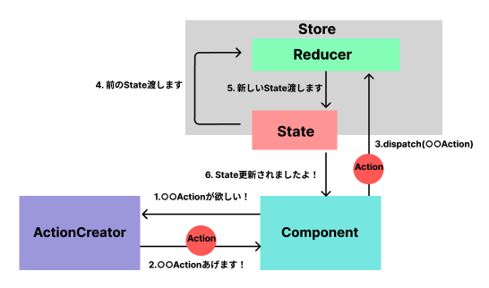

# Reactの状態管理比較表 -Redux・ReduxToolkit・Recoil-

こんにちは！ラクス入社1年目のkoki_matsuraです。

本日は、Redux・ReduxToolkit・Recoilのそれぞれの状態管理方法を簡単なTodoアプリ作成を通して、比較していきたいと思います。

アジェンダは以下の通りです。

- Reactの状態管理比較表 -Redux・ReduxToolkit・Recoil-
  - [Reduxとは](#reduxとは)
    - 概要
    - 構成図
  - [Redux Toolkitとは](#redux-toolkitとは)
    - 概要
    - 構成図
## Reduxとは
### 概要
JavascriptによるSPAは複雑化し続けており、Reactが導入され、Viewとロジック部分を切り離せはしましたが、state（状態）の管理は開発者に委ねられています。

Reduxでは、このstateの問題に下記の3原則を取り入れ状態変化の流れを制限することで解決します。

- Single source of truth (ソースは一つだけ)
  
  アプリケーションの状態は一つのstore内に一つのオブジェクトでツリー型で格納されます。

  状態が一つのstoreで管理されるため、デバッグや開発が簡単になります。

- State is read-only (状態は読み取り専用)

  状態を変更できるのはactionを持ったオブジェクトのみです。つまり、ビューやコールバックが状態を直接的に変更することはできません。

- Changes are made with pure functions (変更は純粋関数で行われる)
  
  アクションがどのようにstateを変更するかはreducerに記述されます。

  reducerは前のstateとactionより、次の状態を返す、副作用のない純粋な関数です。注意点として、状態を変更しているのではなく、新しい状態のオブジェクトを返しています。

  また、開発の際にはアプリケーションで一つのreducerを用意しておき、巨大化してくればreducerを分割することもできます。

### 構成図
  下図はReduxがどのように状態管理をしているかを簡単に示したものになっています。本来であれば、ComponentとReducerの間にはAPIなどの処理を行うMiddlewaresが挟まりますが、省きました。
  
  

  ComponentはユーザーのイベントからActionCreatorにActionの生成を依頼し、生成されたActionをReducerに対し、dispatchします。Reducerは前回のStateとdispatchされたActionから新たなStateを作り出し、それをStateに返します。StateはComponentに対して、更新を通知し、新しいStateを取得するという流れになっています。

  また、Reduxが参考にしているFluxというデザインパターンではActionCreatorがActionの生成・dispatchまでを担当するのが一般的なのですが、ReduxではテストのしやすさからActionCreatorはActionを生成をするだけがいいかもしれない。

## Redux Toolkitとは

### 概要
名前の通り、Reduxを用いた開発を効率的に行うためのツールキットです。

Reduxと比べて、最大のメリットはコード量が減ることです。詳しくは下の構成図で説明させていただきます。他にも、可読性が上がることもやTypeScriptとの相性がいいこともメリットです。

公式はRedux Toolkitの記述法を標準にしてほしく、使用することを強く勧めています。

今後、Reduxを導入したい方はRedux Toolkitで始めると簡単に状態管理できると思われます。また、Reduxを使っていて、Recoilを使いたくはない人にもおすすめできます。

### 構成図
Redux Toolkitでは下図のように状態管理をしています。
