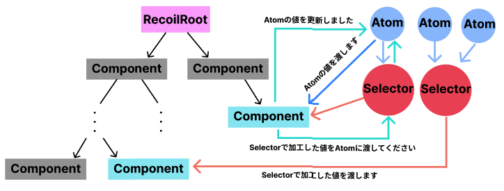

# Reactの状態管理比較表 - Redux・Redux Toolkit・Recoil -

こんにちは！ラクス入社1年目のkoki_matsuraです。

本日は、Redux・ReduxToolkit・Recoilのそれぞれの状態管理方法や仕組みを簡単なTodoアプリ作成を通して、比較していきたいと思います。

かなり長いので、特定の状態管理について知りたい方はアジェンダのリンクから飛ぶとスムーズに読めると思われます。

アジェンダは以下の通りです。

- Reactの状態管理比較表 -Redux・ReduxToolkit・Recoil-
  - [Reduxとは](#reduxとは)
    - 概要
    - 構成図
  - [Redux Toolkitとは](#redux-toolkitとは)
    - 概要
    - 構成図
  - [Recoilとは](#recoilとは)
    - 概要
    - 構成図
  - [Todoアプリ作成](#todoアプリ作成)
    - [作成する前に](#作成する前に)
      - [サンプルと仕様説明](#サンプルと仕様説明)
      - [プロジェクト作成](#プロジェクト作成)
    - [ReduxによるTodoアプリ作成](#reduxによるtodoアプリの作成)
      - 初期設定
      - ディレクトリ構成
      - Stateの定義・Todo型の定義
      - Reducerの定義
      - Storeの定義
      - ActionCreatorの定義
      - TodoContainer.tsxの定義・RootState型の定義
      - TodoPresenter.tsxの定義
      - Providerの定義
      - アプリの起動
      - Todoの追加機能
      - Todoの削除機能
      - 完了・未完了の切り替え機能
      - まとめ
    - [Redux ToolkitによるTodoアプリ作成](#redux-toolkitによるtodoアプリの作成)
      - 初期設定
      - ディレクトリ構成
      - Todo型の定義
      - Sliceの定義
      - Storeの定義
      - TodoContainer.tsxの定義・RootState型の定義
      - TodoPresenter.tsxの定義
      - Providerの定義
      - アプリの起動
      - Todoの追加機能
      - Todoの削除機能
      - 完了・未完了の切り替え機能
      - まとめ
    - [RecoilによるTodoアプリ作成](#RecoilによるTodoアプリ作成)
## Reduxとは
### 概要
JavascriptによるSPAは複雑化し続けており、Reactが導入され、Viewとロジック部分を切り離せはしましたが、state（状態）の管理は開発者に委ねられています。

Reduxでは、このstateの問題に下記の3原則を取り入れ状態変化の流れを制限することで解決します。

- Single source of truth (ソースは一つだけ)
  
  アプリケーションの状態は一つのstore内に一つのオブジェクトでツリー型で格納されます。

  状態が一つのstoreで管理されるため、デバッグや開発が簡単になります。

- State is read-only (状態は読み取り専用)

  状態を変更できるのはactionを持ったオブジェクトのみです。つまり、ビューやコールバックが状態を直接的に変更することはできません。

- Changes are made with pure functions (変更は純粋関数で行われる)
  
  アクションがどのようにstateを変更するかはreducerに記述されます。

  reducerは前のstateとactionより、次の状態を返す、副作用のない純粋な関数です。注意点として、状態を変更しているのではなく、新しい状態のオブジェクトを返しています。

  また、開発の際にはアプリケーションで一つのreducerを用意しておき、巨大化してくればreducerを分割することもできます。ただ、分割方法はユーザで決めなければならないのが欠点かもしれません。

### 構成図
  下図はReduxがどのように状態管理をしているかを簡単に示したものになっています。本来であれば、ComponentとReducerの間にはAPIなどの処理を行うMiddlewaresが挟まりますが、省きました。
  
  

  ComponentはユーザーのイベントからActionCreatorにActionの生成を依頼し、生成されたActionをReducerに対し、dispatchします。Reducerは前回のStateとdispatchされたActionから新たなStateを作り出し、それをStateに返します。StateはComponentに対して、更新を通知し、新しいStateを取得するという流れになっています。

  また、Reduxが参考にしているFluxというデザインパターンではActionCreatorがActionの生成・dispatchまでを担当するのが一般的なのですが、ReduxではテストのしやすさからActionCreatorはActionを生成をするだけがいいかもしれません。

## Redux Toolkitとは

### 概要
名前の通り、Reduxを用いた開発を効率的に行うためのツールキットです。

Reduxと比べて、最大のメリットはコード量が減ることです。詳しくは下の構成図で説明させていただきます。他にも、可読性が上がることもやTypeScriptとの相性がいいこともメリットです。

Reduxの公式はRedux Toolkitの記述法を標準にしてほしく、使用することを強く勧めています。

今後、Reduxを導入したい方はRedux Toolkitで始めると簡単に状態管理できると思われます。

### 構成図
Redux Toolkitでは下図のように状態管理をしています。


Reduxの構成図と比べると、少しシンプルになっているのがわかります。具体的にいうと、図からActionCreatorがなくなりました。実際になくなっている訳ではないのですが、ユーザが意識する必要がなくなりました。

また、それぞれの機能をSliceという単位で切り分けます。Sliceの中には機能ごとのState、Reducerを管理することができるので、Reduxと比べて、管理する状態が増えてもコードの見通しが悪くなくことがないです。

Sliceの中にActionCreatorもあるのですが、先ほども書いた通り、意識する必要がなくなるので省いています。


Redux Toolkitの良さはこれだけでも十分なのですが、個人的に一番メリットに感じているのはStateのイミュータブル性を意識しなくていいことです。ReduxではStateの更新方法が直接変更するのではなく、新しいStateを作り出して返すというものでコードで書いてみると躓きやすかったです。ですが、イミュータブル性を意識しなくていいのでStateを直接変更するような方法で更新することが可能になります。

これに関しては、実際にコードを書くと有り難みが身に沁みます...。

## Recoilとは

### 概要
RecoilはContextAPIが抱えるレンダリングやコード分割の問題を解決するために提唱された、現時点では実験的な状態管理ライブラリであり、アプリケーションの状態をAtomとSelectorの集まりで管理します。

 AtomはStateの単位で一意のキーとデータで管理、SelectorはAtomや他Selectorを受け取る純粋な関数です。Atomを加工して取得したりする目的で用いられます。
 
 Reduxで使っていたようなActionCreator、Reducerのようなものはなく、Hooks APIを使って、状態管理を行います。

### 構成図
Recoilは下図のような仕組みの状態管理をしています。



ReduxからStoreやReducer、DispatchによるActionを送る操作がなくなったような図になっています。

理由はコンポーネントからHooks APIを使用することで簡単にAtomやSelectorの値を取得、変更、更新することができるためです。

わざわざ、DisptchでActionをReducerに送ってStateを変更してもらう必要がなくなったからです。

使ってみると、かなり単純で使いやすいことに気づきます。

## Todoアプリ作成

### 作成する前に

#### サンプルと仕様説明
それぞれの状態管理ライブラリでTodoアプリを作成する前にTodoアプリの仕様と構成を説明します。

構成は以下の画像のようになります。


入力フォームと送信ボタンTodoのリストを載せる部分で構成されます。

また、それぞれのTodoには内容に加え、完了ボタン、削除ボタンがあります。

仕様を説明します。

・Todoの追加

画像上部のタイトル・内容の入力フォームに適当なテキストを入力し、送信ボタンを押すことでTodoリストに入力したTodoが追加されます。

・Todoリストの表示

画像下部のTodoリストは古いもの（ID昇順）から順に表示されます。最も新しいものは最後尾に表示されます。

・Todoの完了

それぞれのTodoについている完了ボタンを押すと、該当するTodoが未完了から完了に変化します。
また、完了しているTodoには「戻す」ボタンが表示されており、これは完了ボタンの逆の働きをします。

・Todoの削除

それぞれのTodoについている削除ボタンを押すと、該当するTodoがリストから削除され、表示からも消えます

以上が今回作成していくTodoアプリの仕様になっています。

#### プロジェクト作成

プロジェクトの作成は下記のコマンドを入力します。「プロジェクト名」の部分はわかりやすい名前にしておくことをお勧めします。

私はReduxを使ったTodoアプリには「redux-todo」、Redux Toolkitでは「redux-toolkit-todo」、Recoilでは「recoil-todo」というプロジェクト名にしました。
```bash
npx create-react-app [プロジェクト名] --template typescript

```
### ReduxによるTodoアプリの作成

<details>
  <summary>初期設定</summary>
プロジェクトが作成後、Reduxを使うために必要になるので、下記のコマンドで作成したプロジェクトに移動して、reduxとreact-reduxをインストールします。

```bash
cd redux-todo
npm i redux react-redux
```
</details>
<details>
  <summary>ディレクトリ構成</summary>
Reduxを使う準備もできましたので、次はディレクトリを使っていきます。

Reduxにおけるディレクトリ構成は様々ありますが、今回はそれぞれの役割がわかりやすいように次のような「store」「action(actionCreator)」「state」「reducer」に分けた構成にします。

「src」ディレクトリ以外は特に触らないので、「src」以下の画像を載せます。


appディレクトリとcommonディレクトリ、featuresディレクトリ、featuresディレクトリの中にtodosディレクトリを作成します。

- appディレクトリ

  - App.tsxを移動
  - store.tsを新規作成

App.tsxを移動させた理由として、ReduxのStoreにアクセスできるのはProviderで囲われたコンポーネントだけで、「App.tsx」の中身を囲って、Todoアプリ全体で状態を共有したかったからです。同じディレクトリに移動させることでどのコンポーネントでProviderが使われているか分かりやすくなります。

- commonディレクトリ
  - todo.type.tsの新規作成
  - rootState.type.tsの新規作成

「todo.type.ts」は今回のTodoアプリで出てくるTodoのタイプを定義し、「rootState.type.ts」には現在のStateのタイプを定義しています。色々なファイルから使われると思われるのでcommonディレクトリに作成しました。

- features/todosディレクトリ
  - todoAction.tsの新規作成
  - todoReducer.tsの新規作成
  - todoState.tsの新規作成
  - TodoContainer.tsxの新規作成
  - TodoPresenter.tsxの新規作成

本来であれば、todosディレクトリは必要ないのですが、featuresは機能を管理するディレクトリなので、todosを挟みました。

todoAction.tsは構成図で表すと、ActionCreatorの役割を果たします。

todoState.tsは状態の定義、todoReducer.tsはactionを受けて、状態を更新する役割を果たします。
</details>
<details>
<summary>Stateの定義・Todo型の定義</summary>
最初はStateを定義します。
Stateは状態のことです。

StateはTodoのリストを管理するので、Todo型の配列を初期値にしたいです。

Todo型はまだ定義していないので、「todo.type.ts」に下記のように定義します。
```typescript
export type Todo = {
    id : number;
    title : string;
    content : string;
    isCompleted : boolean;
}
```
それぞれのTodoは「id」「title」「content」「isCompleted」を持ちます。

Todo型を定義できたので、Stateを「todoState.ts」に下記のように定義します。

適当なデータを2つ入れておきます。
```typescript
import { Todo } from "../../common/todo.type";

export const state = {
    todos: [
        {
        id: 1,
        title: "テスト1",
        content: "テスト1の内容",
        isCompleted: false
        },{
        id: 2,
        title: "テスト2",
        content: "テスト2の内容",
        isCompleted: false
        }
    ] as Todo[]
}
```
</details>

<details>
<summary>Reducerの定義</summary>
Stateが定義できたので、Reducerを「todoReducer.ts」定義します。
今回のTodoアプリの仕様では、「追加」「削除」「完了・未完了のスイッチ」の機能が必要ですが、一旦、何もしないReducerにしておきます。

```typescript
import { state as initialState } from "./todoState";

export const todosReducer = (state = initialState, action: any) => {
    return state
}
```
Reducerでは、第一引数に前のState、第二引数にActionを受け取ります。

ActionはActionCreatorで作成されるもので「type」を必ず持っており、必要に応じて、「payload」を持ちます。
</details>

<details>
<summary>Storeの定義</summary>
状態管理の元となるStoreを定義します。「store.ts」に下記のように書きます。

```typescript
import { legacy_createStore as createStore } from 'redux'
import { todosReducer } from '../features/todos/todoReducer'

export const store = createStore(todosReducer)
```
createStoreに引数でReducerを入れることでstoreが出来上がります。

注意点：

現在、createStoreは公式から推奨されていないので、1文目のインポート文を入れないとエラーが起きます。
</details>

<details>
<summary>ActionCreatorの定義</summary>
ActionCreatorは名前の通り、Actionを作る役割をします。

 Actionを作る役割と言っても、typeとpayloadをオブジェクトで返すだけです。

typeの名前とpayloadの型がReducerのものと合わせる必要がありますが、まだReducerの方で処理を書いていないので、こちらを基準にしていきます。

下記のようにしましょう。
```typescript
import { Todo } from "../../common/todo.type";
/** Todoを加えるアクションを返す */
export const addTodoAction = (newTodo : Todo) => {
    return {
        type: "ADD",
        payload: newTodo
    }
}
/** Todoを更新するアクションを返す */
export const toggleCompleteAciton = (id : number) => {
    return {
        type: "TOGGLE_COMPLETE",
        payload: id
    }
}
/** Todoを削除するアクションを返す */
export const removeTodoAction = (id : number) => {
    return {
        type: "REMOVE",
        payload: id
    }
}
```
</details>

<details>
<summary>TodoContainer.tsxの定義・RootState型の定義</summary>
このファイルではTodoアプリのロジック部分を担当します。

useSelectorを使うことでStateを取得できます。Stateの型はRootStateという名前にします。

RootStateとTodoPresenterはまだ定義していないためエラーが出ていても問題ありません。
```typescript
import { useSelector } from "react-redux"

export const TodoContainer = () => {
    const todos = useSelector((state: RootState) => state.todos)

    const args = {
        todos,
    }
    return <TodoPresenter {...args} />
}

```
「rootState.type.ts」に下記のようにRootState型を定義します。
```typescript
import { store } from "../app/store";

export type RootState = ReturnType<typeof store.getState>
```
「store.getState」はインポートしたStoreから全てのStateを取得できます。その型をRootStateに入れています。

このRootState型をTodoContainerにインポートすれば、型エラーはなくなります。
</details>

<details>
<summary>TodoPresenter.tsxの定義</summary>
このアプリではTodoアプリの表示部分を担当します。

Todoリストを表示します。
まずは、色々な機能を作る前に基盤を作りたいので下記のようなコードにします。
```typescript
import React, { useState } from "react"
import { Todo } from "../../common/todo.type"

type TodoPresenterProps = {
    todos : Todo[]
}
export const TodoPresenter : React.FC<TodoPresenterProps> = ({
    todos,
}) => {
    const [title, setTitle] = useState("");
    const [content, setContent] = useState("");
    
    return (
    <>
    <form>
        <label>
            タイトル：
            <input type="text" value={title} onChange={e => setTitle(e.target.value)} />
        </label>
        <label>
            内容：
            <input type="text" value={content} onChange={e => setContent(e.target.value)} />
        </label>
        <button type="button">送信</button>
    </form>
    <div>-------------------------</div>
    <h1>Todoリスト</h1>
    {todos.map((todo : Todo)=> {
        return ( 
            <React.Fragment key={todo.id}>
                <div>{todo.title} : {todo.isCompleted ? "完了" : "未完了"}</div>
                <div>内容：{todo.content}</div>
                <button type='button'>{todo.isCompleted ? "戻す" : "完了"}</button>
                <button type='button'>削除</button>
            </React.Fragment>
        )
    })}
    </>
    )
}
```
入力部にはタイトルと内容の入力フォームとまだ機能のついていない送信ボタンを配置しています。

出力部にはTodoリストをmap関数で出力しています。それぞれのTodoにつくボタンも現時点では機能がついていません。

一旦、これで置いておきます。
</details>

<details>
<summary>Providerの設定</summary>
必要なファイルはすべて完了しました。しかし、これだけでは状態を管理できません。

ReduxではStateを共有したいコンポーネントをProvdierで囲むことで機能します。

今回の場合では、TodoContainer内だけでStateを共有したいです。

なので、「App.tsx」の元のコードを消して、次のようなコードに変えてください。
```typescript
import React from 'react';
import { Provider } from 'react-redux'
import { store } from "./store"
import { TodoContainer } from '../features/todos/TodoContainer';
function App() {
  return (
    <div className="App">
      <Provider store={store}>
        <TodoContainer />
      </Provider>
    </div>
  );
}

export default App;

```
これでTodoContainer内でStateの情報を共有できるようになりました。
</details>
<details>
<summary>アプリの起動</summary>

下記のコマンドで起動してみましょう。
```bash
npm start
```
自動で開くと思いますが、開かない方は「http://localhost:3000/」にアクセスしてください。

次のようにStateを定義したときに入れたサンプルデータが2件分、表示されていればうまくいっています。


</details>
<details>
<summary>Todoの追加機能</summary>
送信ボタンを押すと、Todoを追加できるようにします。

構成図の通りに説明すると、TodoContainerでActionCreatorに追加処理のActionを作成してもらって、それをdispatch関数でReducerに流す処理を書きます。

まずは、「TodoContainer.tsx」に新しいTodoのタイトルと内容を引数にとって、ReducerにActionを送る関数を作ります。

関数の名前は「addTodo」にします。次のコードを「TodoContainer.tsx」のtodosとargsの間に加えてください。
```typescript
const maxID = todos.length ? todos.slice(-1)[0].id : 0;
const dispatch = useDispatch();

const addTodo = (title: string, content: string) => {
    const newTodo : Todo = {
        id: maxID+1,
        title: title,
        content: content,
        isCompleted: false
    }
    dispatch(addTodoAction(newTodo));
 }
```
dispatch関数は「react-redux」から、addTodoActionは「todoAction.ts」からインポートします。

maxIDはTodoリストの最大のIDを取得してきます。もし、Todoが0個の場合は0を返すようにします。

argsにaddTodo関数を追加して、「TodoPresenter.tsx」に渡しましょう。
「TodoPresenter.tsx」では、送信ボタンを押下時にaddTodo関数を実行するようにしたいです。

なので、addTodo関数を実行し、その後に入力内容を空にするsendTodo関数を作成します。その関数を送信ボタン押下時に実行させるように下記のコードを「TodoPresenter.tsx」に追加します。
```typescript
 const sendTodo = () => {
        addTodo(title, content);
        setTitle("");
        setContent("");
　}

//省略

 <button type="button" onClick={() => addTodo(title, content)}>送信</button>
```
これで、送信ボタンを押下時に、addTodo関数を実行できます。

ReducerでこのAction(type: "ADD", payload: newTodo)に合う処理を書きます。

「todoReducer.ts」を次のように書き換えます。
```typescript
export const todosReducer = (state = initialState, action : any) => {
    switch (action.type) {
        case "ADD":
            return { todos: [...state.todos, action.payload] }
        default:
            return state;
    }
}
```
Reducerでは、action.typeを見て、処理を変えます。

action.typeは「todoAction.ts」で定義したものと一致させないといけません。

また、注意点としてReduxの原則にも書いてありますが、Stateを直接変更するのではなく、前のStateとActionから新しいStateを作り出すようにします。これが個人的に少し躓きやすい点かなと思います。

これで、追加の処理が書けました。実際に、入力部にタイトルと内容を入力して送信ボタンを押すと、既存のリストの下に追加されていることが確認できると思います。
</details>
<details>
<summary>Todoの削除機能</summary>
追加処理と仕組みは同じです。

それぞれのTodoについている削除ボタンを押すと、リストから削除されるようにします。

「TodoContainer.tsx」にAddTodo関数と同様にremoveTodo関数を次のように作ります。
```typescript
const removeTodo = (id: number) => {
        dispatch(removeTodoAction(id))
    }
```
argsにremoveTodo関数を渡して、「TodoPresenter.tsx」では、削除ボタンを押したときに削除したいTodoのidを引数にしてremoveTodo関数を実行するようにします。

下記のように「TodoPresenter.tsx」の削除ボタンを変更してください。
```typescript
<button type='button' onClick={() => removeTodo(todo.id)}>削除</button>
```
削除ボタン押下時に、removeTodoが実行されるようになったので、ReducerでこのAction(type: REMOVE, payload: id)に合う処理を書きます。

次のようにswitch分にcaseを増やすような形で書いてください。
```typescript
case "REMOVE":
    return {todos : state.todos.filter((todo) => todo.id !== action.payload)}
```
これで、削除ボタンを押すと、該当のTodoがリストから消えるようになります。
</details>

<details>
<summary>完了・未完了の切り替え機能</summary>
それぞれのTodoについている完了ボタンを押すと、タイトルの横の「未完了」テキストが「完了」テキストになるようにします。また、完了ボタンは「戻る」というテキストのボタンに変化します。

この戻るボタンを押すと、完了ボタンとは逆の操作をします。

「TodoPresenter.tsx」の完了ボタンとタイトル横のテキストのコードを見てみると、todo.isCompletedで切り替えられることがわかります。

なので、isCompletedを切り替えられる関数を作りましょう。
```typescript
<div>{todo.title} : {todo.isCompleted ? "完了" : "未完了"}</div>
<div>内容：{todo.content}</div>
<button type='button'>{todo.isCompleted ? "戻す" : "完了"}</button>
```
まずは、「TodoContainer.tsx」にtoggleComplete関数を次のように作ります。
```typescript
const toggleComplete = (id: number) => {
    dispatch(toggleCompleteAciton(id))
}
```
argsにtoggleComplete関数を追加し、下記のように「TodoPresenter.tsx」の完了ボタンを押下時にtoggleComplete関数が実行するようにします。
```typescript
<button type='button' onClick={() => toggleComplete(todo.id)}>{todo.isCompleted ? "戻す" : "完了"}</button>
```
最後はReducerでActionを受け取り、isCompletedを切り替える処理を書きましょう。

次のコードをswitch文のcaseとして追加することで実装できます。
```typescript
case "TOGGLE_COMPLETE":
    return { todos: state.todos.map((todo) => {
        if (todo.id !== action.payload) return todo
        
        return {...todo, isCompleted : !todo.isCompleted}
    })}
```
完了ボタンを押すと、それぞれのTodoタイトルの横の「未完了」が「完了」に切り替わることが確認できると思います。
</details>
<details>
<summary>まとめ</summary>
これで仕様通りのTodoアプリをReduxを使って作成できました。

かなり定義するものが多かったですし、ファイル数が多いなと思われたのではないでしょうか。
私自身も、最初使った時はそのように感じました。

Todoアプリのように小さい規模のものだとReduxは少し冗長的で面倒に感じるのですが、大きな規模のアプリになっていくと、それぞれの役割に細かく分けている構成の恩恵を受けやすくなるのかもしれません。

また、今回はそれぞれの役割が分かりやすくなるようにわざとファイルを細かく分けていたのですが、StateとAction、Reducerは密な関係になることが多いので、一つのファイルで管理することもできます。
</details>


### Redux ToolkitによるTodoアプリの作成

<details>
<summary>初期設定</summary>
Redux Toolkitを用いて、開発するにはReduxで用いたライブラリに加え、「@reduxjs/toolkit」を入れなければなりません。

下記のコマンドでプロジェクトに入り、それらのライブラリを入れます。
```bash
  cd redux-toolkit-todo
  npm i redux react-redux @reduxjs/toolkit
```
</details>

<details>
<summary>ディレクトリ構成</summary>
Redux Toolkitを用いた時のsrcは以下のようなディレクトリ構成にします。


Reduxの時と同じ構成になっていますので、共通部分のディレクトリとファイルの説明を省かせていただきます。

詳細なディレクトリやファイルの意図を読みたい方は[ReduxによるTodoアプリの作成](#reduxによるtodoアプリの作成)のディレクトリ構成に記しています。

Reduxと違う構成をしているのはtodosディレクトリ内だけです。
- features/todosディレクトリ
  - todoSlice.tsの新規作成
  - TodoContainer.tsxの新規作成
  - TodoPresenter.tsxの新規作成

「todoSlice.ts」はReduxで言うと、「todoState.ts」「todoReducer.ts」「todoAction.ts」を一つにまとめたようなものです。

ReduxによるTodoアプリの作成のまとめでも書きましたが、StateとAction、Reducerは密な関係になることが多いため、まとめた方が書きやすくコードも追いやすいのです。
</details>

<details>
<summary>Todo型の定義</summary>
ReduxのTodoアプリ同様に「todo.type.ts」にTodo型を記述します。

```typescript
export type Todo = {
    id : number,
    title : string,
    content : string,
    isCompleted : boolean
}
```
</details>
<details>
<summary>Sliceの定義</summary>
早速、Sliceを定義していきます。

Sliceの中にはState、Reducer、Actionを記述します。
Stateには適当なデータを2つ入れておきます。

基本的な書き方は以下のようになります。
```typescript
import { createSlice } from "@reduxjs/toolkit";
import { Todo } from "../../common/todo.type";

const state = {
  todos: [ 
    {
      id: 1,
      title: "テスト1",
      content: "テスト1の内容",
      isCompleted: false
    },
    {
      id: 2,
      title: "テスト2",
      content: "テスト2の内容",
      isCompleted: false
    }
  ] as Todo[]
}

export const todoSlice = createSlice({
    name: 'todoSlice',
    initialState: state,
    reducers:{
        //Actionを記述する
    }
})
```
createSlice関数に、「name」、「initialState(State)」、「reducer」をオブジェクトにして渡しています。

これで最も基本的なSliceを定義できます。
</details>
<details>
<summary>Storeの定義</summary>
Sliceを定義できたので、次はStoreを定義していきます。

Storeの定義方法もReduxとは少し変わってきます。
次のようにして、作成できます。

```typescript
import { configureStore } from "@reduxjs/toolkit"
import { todoSlice } from "../features/todos/todoSlice"

export const store = configureStore({
    reducer : todoSlice.reducer
})
```
configureStore関数の中でreducerにtodoSlice内のReducerを渡すことで登録できます。

configureStore関数に登録するReducerが単数の場合は、それがStoreのルートリデューサーとなります。

複数の場合は、combineReducersでReducerをまとめてから登録することをお勧めします。

また、configureStore関数にはreducer以外にも、middleware、devTools、preloadedState、enhancersもオプションとしてあります。

</details>

<details>
<summary>TodoContainer.tsxの定義・RootState型の定義</summary>

Slice側は仮ではありますが実装できたので、TodoContainer.tsxを定義します。

Reduxの時と全く同じコードです。

RootState型とTodoPresenterはまだ定義していないのでエラーが出ます。
```typescript
import { useSelector } from "react-redux"

export const TodoContainer = () => {
    const todos = useSelector((state : RootState) => state.todos)

    const args = {
        todos,
    }
    return <TodoPresenter {...args} />
}
```
RootState型を定義しましょう。

これもReduxの時と全く同じコードになっています。
```typescript
import { store } from "../app/store";

export type RootState = ReturnType<typeof store.getState>
```
ストアの全てのStateのタイプをRootState型として定義しています。

この型を「TodoContainer.tsx」にインポートすれば、RootStateのエラーは消えます。
</details>

<details>
<summary>TodoPresenter.tsxの定義</summary>

TodoPresenterコンポーネントもReduxの時と全く同じものです。
```typescript
import React, { useState } from "react"
import { Todo } from "../../common/todo.type"

type TodoPresenterProps = {
    todos : Todo[]
}
export const TodoPresenter : React.FC<TodoPresenterProps> = ({
    todos,
}) => {

    const [title, setTitle] = useState("");
    const [content, setContent] = useState("");
    
    return (
    <>
    <form>
        <label>
            タイトル：
            <input type="text" value={title} onChange={e => setTitle(e.target.value)} />
        </label>
        <label>
            内容：
            <input type="text" value={content} onChange={e => setContent(e.target.value)} />
        </label>
        <button type="button">送信</button>
    </form>
    <div>-------------------------</div>
    <h1>Todoリスト</h1>
    {todos.map((todo : Todo)=> {
        return ( 
            <React.Fragment key={todo.id}>
                <div>{todo.title} : {todo.isCompleted ? "完了" : "未完了"}</div>
                <div>内容：{todo.content}</div>
                <button type='button'>{todo.isCompleted ? "戻す" : "完了"}</button>
                <button type='button'>削除</button>
            </React.Fragment>
        )
    })}
    </>
    )
}
```
</details>

<details>
<summary>Providerの定義</summary>
Providerの扱いもReduxと同じです。
Stateを使いたいルートコンポーネントを囲う形で使います。

TodoContainerをルートコンポーネントにStateを使いたいので、「App.tsx」を次のように書き換えます。

```typescript
import { Provider } from "react-redux";
import { TodoContainer } from "../features/todos/TodoContainer";
import { store } from "./store";

function App() {
  return (
    <div className="App">
      <Provider store={store}>
        <TodoContainer />
      </Provider>
    </div>
  );
}

export default App;
```
</details>


